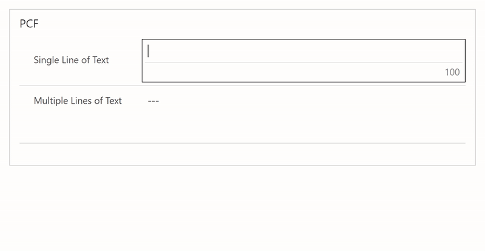

# D365 PCF - Characters Remaining

This is a PCF Control to show the number of characters remaining in the field, similar to what is seen on twitter

## Supported controls

This can be used on a "Single Line of Text" or a "Multiple Lines of Text" field

## Installing the control

Solution file can be found on the <a href="https://github.com/cathalnoonan/d365-pcf-charactersremaining/releases">releases page</a>

## Configuration

- Open the form editor, then double click the field that should use this control
- In the configuration window, select the `Controls` tab
- Select `Add Control...`
- Select `Characters Remaining`
- In the Properties of the control, enter the number of lines to use
  - This is not mapped to the number of lines configured for the Multiple Lines of Text fields because there is no access to that information within the PowerApps Component Framework
- Click OK, Save and Publish the form

## Error messages

The control surfaces the same error messages as the default controls used by Dynamics 365

